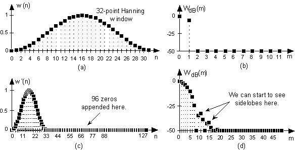
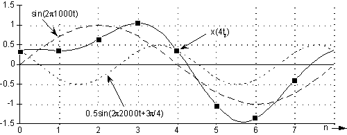
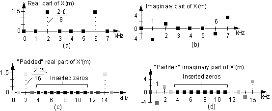
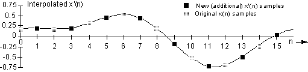

> Frequency Domain Zero Padding (FDZP) leads to interpolation in the time domain.

### Introduction

A well known principle in digital signals is that zero padding in one domain results in the increase of the sampling rate in the other domain. The most used form of zero padding is to append zeros to the end of a time-domain signal. For example, it can be seen below a 32 samples Hanning window with its time (a) and frequency (b) representations, then what happens in the frequency domain (d) if we add 96 zeros the time domain (a). The sampling was increased by a factor of 4.

Figure 1

This project focuses on the other form of zero padding. To illustrate, we can take a signal composed of 1kHz and 2kHz harmonics, sampled at 8kHz.

x(n) = sin(2·π·1000·tS) + 0.5sin(2·π·2000·tS+3π/4)
For a whole period of x(n), the 8 samples are marked black.

Figure 2

The zeros (0+0j) should be inserted this time in the middle of the spectrum, so for both real (a) and imaginary (b) parts. For this example, 8 zero value samples were introduced (c), (d).

Figure 3

Finally, by computing Inverse Discrete Fourier Transform on the obtained frequency domain signal, we will get x'(n), which has 8 extra samples, marked with black squares. The other 8 samples coincide with the ones in x(n), while these additional samples appear in between.

Figure 4

Remarks:
- A multiple of the number of the initial samples should be chosen as the number of inserted zeros. This way, the final result will contain the original time samples.
- The interpolated signal is complex, even if we start from a real signal. However, the complex should be close to zero, so it can be neglected, since the zero padded spectrum is symmetrical and the values should be just computational error.
- Nyquist sampling criterion must be satisfied. This has to do with the discrete signal in the first place, but it should be noted that FDZP interpolation won't bring new information as frequencies higher than sampling frequency.
- Given the aforementioned criterion is met, the interpolated samples match the analog signal, before it was sampled.
- If the input signal isn't periodic, the interpolated signal will contain some errors at the beginning an at the end due to representing discontinuities with a finite number of frequency components. In other words, Gibbs phenomenon will be present.

### Implementation

[//]: <> (based on generated sine from lookup table sin, computing DFT, padding the spectrum, IDFT, save, plot and validate with Matlab)

The purpose of this project was to develop an application, optimized for StarCore 140, that can run the FDZP.

To keep the possibility to obtain any multiple of the original samples as interpolated points, it was opted to implement the plain IDFT algorithm. Starting from the IDFT formula, it appears that a method to obtain sine sequences of any length ≥ 2 is required and these are obtained by linear interpolation on a given sine lookup table.

The application zero pads the input spectrum, calls the IDFT function, which is based on generated sine waves, then saves the obtained signal in a binary file. Next, the obtained signal is be opened inside Matlab and checked against an expected interpolated signal.

___
#### References:

1) Richard G. Lyons, "Time-Domain Interpolation using the FFT", in *Understanding Digital Signal Processing*, Pearson Education, 2011, p. 778